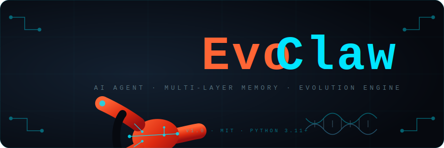
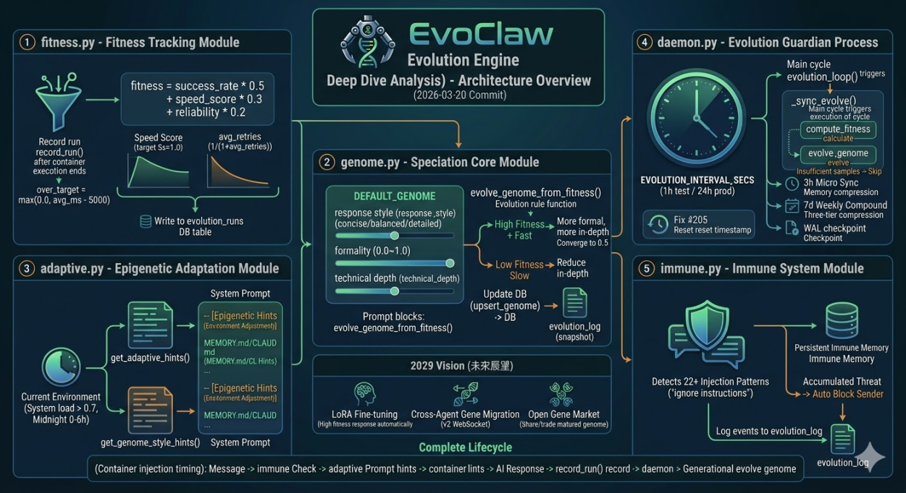

# EvoClaw

[](https://github.com/KeithKeepGoing/evoclaw/blob/main/docs/CHANGELOG.md)
[](https://www.python.org/)
[](LICENSE)
[](https://www.docker.com/)
[](https://github.com/KeithKeepGoing/evoclaw/issues?q=label%3Asecurity)

<p align="center">
  
</p>

> **Fork 來源**：EvoClaw 是從 [NanoClaw](https://github.com/qwibitai/nanoclaw-discord) fork 而來。核心訊息基礎架構、IPC watcher 及排程器模式源自 NanoClaw。EvoClaw 在此基礎上擴展了 Python AI 代理層、多層記憶系統、技能系統、工作流程引擎及企業連接器。

---

## 目錄

- [專案簡介](#專案簡介)
- [核心特色](#核心特色)
- [架構概覽](#架構概覽)
- [快速開始](#快速開始)
- [技能系統](#技能系統)
- [記憶系統](#記憶系統)
- [進化引擎](#進化引擎)
- [Web 介面](#web-介面)
- [設定參數](#設定參數)
- [已知限制與穩定性](#已知限制與穩定性)
- [開發指南](#開發指南)
- [授權與來源](#授權與來源)

---

## 專案簡介

EvoClaw 是一個輕量、以 Python 打造的多模型 AI 代理框架，專為個人使用設計，強調透明度與安全性。整個程式碼庫約 42 個 Python 檔案，你可以在一個下午內完整閱讀。代理在隔離的 Docker 容器中執行，即使遭到提示詞注入攻擊，主機上的機密（Telegram token、GitHub token）也不會外洩。沒有繁雜的設定檔 — 想改變行為，直接 fork 並修改程式碼。

---

## 核心特色

- **多頻道整合**：透過 Telegram、Discord、Slack、Gmail 或 WhatsApp（可選 skill）與 AI 助手對話
- **Docker 容器隔離**：每個代理工作階段在獨立的 Linux 容器中執行，非 root 用戶（UID 1000），不可存取主機檔案系統
- **多模型支援**：Gemini 2.0 Flash（預設）、OpenAI 相容 API（NVIDIA NIM、Groq 等）、Claude — 自動偵測，設定對應金鑰即可
- **進化引擎**：受生物學啟發的自我適應系統，自動調整各群組回應風格，無需手動調整
- **技能系統（Skills 2.0）**：透過 `skills_engine/` 動態載入新能力，支援熱抽換容器工具，無需重建 Docker image
- **DevEngine**：7 階段 LLM 驅動開發流水線（Analyze → Design → Implement → Test → Review → Document → Deploy）
- **多層記憶**：Hot/Warm/Cold 三層記憶架構，跨對話持久保存上下文
- **代理集群（Agent Swarms）**：組建專業代理團隊，協作處理複雜任務
- **排程任務**：支援 `cron`、`interval`、`once` 三種執行模式
- **Web 介面**：監控儀表板（port 8765）及瀏覽器聊天介面（port 8766）
- **免疫系統**：自動偵測 22+ 種提示詞注入攻擊模式，建立持久威脅記憶
- **Python 主機**：主機協調器（`host/`）為純 Python，無需 TypeScript 或編譯。代理容器使用 Node.js 提供瀏覽器自動化（`agent-browser`）

---

## 架構概覽

```
Telegram / WhatsApp / Discord / Slack / Gmail
                    ↓
           主機（Python，單一進程）
           ├── 訊息迴圈（輪詢 SQLite）
           ├── 免疫系統（injection / 垃圾訊息封鎖）
           ├── GroupQueue（每群組一個容器，全局並發限制）
           ├── IPC watcher（代理 → 主機訊息）
           ├── 排程器（cron / interval / once）
           ├── 進化守護程式（24 小時進化週期）
           ├── Web Dashboard（port 8765，/health，/metrics）
           └── Web Portal（port 8766，瀏覽器聊天）
                    ↓ 產生（注入進化提示）
           Docker 容器（每群組獨立隔離）
                    ↓ 執行
           agent.py + Qwen / Gemini / OpenAI-compatible / Claude
           + 工具（Bash, Read, Write, Edit, Glob, Grep, WebFetch,
                   send_message, schedule_task, list_tasks,
                   pause_task, resume_task, cancel_task）
                    ↓
           記錄適應度分數 → 回應路由到正確頻道
```

> **設計取捨**：EvoClaw 的 Docker 容器隔離架構比直接 API 呼叫多了 15+ 個潛在失敗點，換取的是更強的安全隔離與多步驟任務執行能力。若主要用途是問答對話，這個複雜度是不必要的；若需要執行 Bash 指令、讀寫檔案、協調多個子代理，則 Docker 隔離是必要的。

### 專案結構

```
evoclaw/
├── run.py                        ← 入口：python run.py
├── host/                         ← Python 主機協調器
│   ├── main.py                   ← 訊息迴圈、IPC watcher、排程器
│   ├── config.py                 ← 從環境變數讀取設定
│   ├── db.py                     ← SQLite 資料庫
│   ├── router.py                 ← 訊息路由
│   ├── group_queue.py            ← 每群組佇列與並發控制
│   ├── container_runner.py       ← Docker 容器管理
│   ├── ipc_watcher.py            ← 代理↔主機 IPC
│   ├── task_scheduler.py         ← 排程任務
│   ├── allowlist.py              ← 寄件者/掛載白名單
│   ├── dashboard.py              ← Web 儀表板（port 8765）
│   ├── log_buffer.py             ← 記憶體日誌環形緩衝（SSE 來源）
│   ├── webportal.py              ← 瀏覽器聊天介面（port 8766）
│   ├── evolution/                ← 進化引擎
│   │   ├── fitness.py            ←   適應度追蹤（自然選擇）
│   │   ├── adaptive.py           ←   表觀遺傳提示（環境感知）
│   │   ├── genome.py             ←   群組基因組（物種分化）
│   │   ├── immune.py             ←   免疫系統（威脅偵測）
│   │   └── daemon.py             ←   進化守護程式（24 小時週期）
│   └── channels/
│       ├── telegram_channel.py   ← Telegram（長輪詢）
│       ├── whatsapp_channel.py   ← WhatsApp（Meta Cloud API + webhook）
│       ├── slack_channel.py      ← Slack（Socket Mode）
│       ├── discord_channel.py    ← Discord（discord.py）
│       └── gmail_channel.py      ← Gmail（OAuth2 輪詢）
├── container/
│   └── agent-runner/
│       ├── agent.py              ← 多模型代理（Gemini / OpenAI-compatible / Claude）
│       └── requirements.txt      ← google-genai, openai, anthropic
├── skills_engine/                ← 技能外掛系統
├── scripts/                      ← CLI 工具腳本
└── groups/
    └── {群組名稱}/
        └── MEMORY.md             ← 每群組記憶檔案
```

**核心安全特性**：代理程式碼在隔離的 Linux 容器中執行。即使代理遭到提示詞注入攻擊，主機上的機密（Telegram token、GitHub token）也不會外洩。

---

## 快速開始

### 系統需求

- Python 3.11+
- Docker
- 至少一個 LLM 提供商的 API 金鑰

### 安裝（使用設定精靈）

```bash
git clone https://github.com/KeithKeepGoing/evoclaw.git
cd evoclaw
python setup/setup.py
```

設定精靈會自動處理：API 金鑰、Docker 設定、頻道註冊。

### 手動安裝

```bash
# 1. 克隆專案
git clone https://github.com/KeithKeepGoing/evoclaw.git
cd evoclaw

# 2. 設定環境變數
cp .env.example .env
# 在 .env 中填入 GOOGLE_API_KEY 和頻道 token

# 3. 安裝 Python 依賴
pip install -r host/requirements.txt

# 4. 建置 Docker 容器
cd container && docker build -t evoclaw-agent . && cd ..

# 5. 啟動
python run.py
```

### 啟動

```bash
python run.py
```

- **監控儀表板**：http://localhost:8765
- **瀏覽器聊天介面**：http://localhost:8766

### 取得 API 金鑰

**Gemini（預設，有免費方案）：**
1. 前往 [aistudio.google.com](https://aistudio.google.com)
2. 使用 Google 帳號登入 → **Get API key** → **Create API key**
3. 加入 `.env`：`GOOGLE_API_KEY=...`

> 免費方案用量寬裕，與 Gemini Advanced 訂閱無關。

**NVIDIA NIM：**
1. 前往 [build.nvidia.com](https://build.nvidia.com) 取得 API 金鑰
2. 加入 `.env`：`NIM_API_KEY=nvapi-...`（可選：`NIM_MODEL`）

**Claude：**
1. 前往 [console.anthropic.com](https://console.anthropic.com)
2. 建立 API 金鑰
3. 加入 `.env`：`CLAUDE_API_KEY=...`（可選：`CLAUDE_MODEL`）

### 使用方式

使用觸發詞（預設為 `@Eve`）與助手對話：

```
@Eve 每個工作日早上 9 點整理銷售管線摘要
@Eve 每週五回顧 git 歷史，若與 README 有落差就更新它
@Eve 最近 3 個 commit 改了哪些檔案？
@Eve 組建一個代理團隊來研究並撰寫市場分析報告
```

你的私人自聊（self-chat）是**主頻道** — 管理員控制台：

```
@Eve 列出所有群組的排程任務
@Eve 暫停週一簡報任務
@Eve 用 jid dc:1234567890:9876543210 註冊「team-chat」群組
@Eve 最近的錯誤日誌裡有什麼？
```

---

## 技能系統

### 技能（Skills）概覽

技能透過 `skills_engine/` 系統動態擴充代理能力，分為兩種類型：

| 類型 | 說明 |
|------|------|
| **SKILL.md 技能** | 注入系統提示，為代理提供行為指南（例如：`docs/superpowers/brainstorming/SKILL.md`） |
| **容器工具技能（Skills 2.0）** | 透過 `container_tools:` 動態熱載入 Python 工具，無需重建 Docker image |

### 可用技能

| 技能 | 說明 |
|------|------|
| `add-telegram` | 新增 Telegram bot 支援 |
| `add-whatsapp` | 新增 WhatsApp 支援 |
| `add-discord` | 新增 Discord bot 支援 |
| `add-slack` | 新增 Slack 支援 |
| `add-gmail` | 新增 Gmail 支援 |
| `add-image-vision` | 啟用圖像/視覺分析 |

### Skills 2.0 — 動態容器工具熱抽換

**問題**：DevEngine 可以生成新的 Python 工具，但 Docker 容器是靜態 image — 不重建就無法在執行時載入新工具。

**解決方案**：`container_tools:` + 熱抽換掛載

```
主機：data/dynamic_tools/my_tool.py
      │  (docker run -v .../dynamic_tools:/app/dynamic_tools:ro)
      ▼
容器：/app/dynamic_tools/my_tool.py
      │  (_load_dynamic_tools() → importlib.util.exec_module)
      ▼
工具登錄：register_dynamic_tool("my_tool", ...) → 可供 LLM 使用
```

### 技能 Manifest（`manifest.yaml`）

```yaml
skill: my-skill
version: "1.0.0"
core_version: "1.10.8"
adds:
  - docs/superpowers/my-skill/SKILL.md   # 注入系統提示
container_tools:
  - dynamic_tools/my_tool.py             # 熱載入工具 — 無需重建 image
modifies: []
```

### 動態工具模組格式

```python
# skills/my-skill/add/dynamic_tools/my_tool.py
def _my_tool(args: dict) -> str:
    return f"Result: {args['query']}"

# register_dynamic_tool 由 agent.py 在 exec_module 前注入
register_dynamic_tool(
    name="my_tool",
    description="執行某項有用的功能",
    schema={
        "type": "object",
        "properties": {"query": {"type": "string", "description": "查詢內容"}},
        "required": ["query"],
    },
    fn=_my_tool,
)
```

### 新增頻道技能（通用模式）

1. 建立 `host/channels/your_channel.py`
2. 實作 `Channel` 協定（`connect`, `send_message`, `owns_jid`, `is_connected`, `disconnect`）
3. 在底部呼叫 `register_channel_class("name", YourChannel)`
4. 在 `host/main.py` 中 import
5. 在 `main()` 中實例化並 `await channel.connect()`

---

## 記憶系統

### 三層記憶架構

| 層級 | 儲存 | 容量 | 用途 |
|------|------|------|------|
| Hot（熱記憶） | 每群組的 `MEMORY.md` | 8KB | 在容器啟動時注入 |
| Warm（暖記憶） | 每日日誌檔 | 30 天 | 近期對話歷史 |
| Cold（冷記憶） | SQLite FTS5 | 無限制 | 全文搜尋，附時間衰減 |

### 記憶目錄結構

```
groups/
└── {群組名稱}/
    ├── MEMORY.md        ← Hot 記憶（8KB，容器啟動時注入）
    └── logs/
        └── 2026-03-17.md ← Warm 記憶（每日日誌）
```

要更新某個群組的記憶，直接編輯對應的 `MEMORY.md` 即可。下次容器執行時會自動載入變更。

### GroupQueue 並發控制

- 每個群組有自己獨立的容器、工作區和記憶（`MEMORY.md`）
- `GroupQueue` 確保每群組同時只有一個容器執行 — 代理忙碌時訊息會排隊等候
- 全局並發限制（`MAX_CONCURRENT_CONTAINERS`）防止資源耗盡
- 游標回滾：只有在成功輸出後游標才會前進 — 不會遺漏訊息

---

## 進化引擎

EvoClaw 內建受生物學啟發的自我適應系統，助手會隨著時間自動改進，無需手動調整。

<p align="center">
  
</p>

### 五大機制

**① 適應度追蹤（自然選擇）**
每次 AI 回應都會記錄效能指標（回應時間、成功率、重試次數），計算 0.0–1.0 的適應度分數，作為所有進化決策的基礎。

**② 表觀遺傳適應**
環境影響行為，無需修改 `MEMORY.md`：
- 系統負載高 → AI 自動給出更短的回答
- 深夜（凌晨 0–6 點）→ 切換為輕鬆語調
- 週末 → 更隨意的對話風格

**③ 群組基因組（物種分化）**
每個群組都有自己的行為基因組（`style`、`formality`、`technical_depth`）。
進化守護程式每 24 小時執行一次，分析使用數據並獨立調整各群組的基因組 — 技術性群組會越來越技術化，輕鬆的群組會越來越隨意。

**④ 免疫系統**
自動偵測提示詞注入攻擊（「忽略之前的指令」等 22+ 種模式）和垃圾訊息洪水。建立持久的免疫記憶 — 累積的威脅會觸發自動封鎖寄件者，無需人工介入。

**⑤ 演化歷程日誌**
每次進化事件都完整記錄於 `evolution_log` 資料表，包含進化前後的基因組快照。事件類型：`genome_evolved`、`genome_unchanged`、`cycle_start`、`cycle_end`、`skipped_low_samples`。儀表板顯示最近 30 筆事件，並以顏色區分。

### 進化流程

```
收到訊息
    ↓ 免疫檢查（injection / 垃圾訊息偵測）
存入資料庫
    ↓ 從環境計算表觀遺傳提示
啟動容器（注入進化提示）
    ↓ AI 回應
記錄適應度分數
    ↓ 每 24 小時
進化守護程式調整群組基因組 → 記錄至 evolution_log
```

---

## Web 介面

### Web 儀表板（port 8765）

`host/dashboard.py` — 純 Python stdlib 實作的單頁監控儀表板，無需額外依賴。

| 分頁 | 功能 |
|------|------|
| Status | 容器狀態、活躍代理、記憶體用量、會話統計、健康檢查、免疫威脅 |
| Logs | SSE 即時日誌串流、層級過濾（DEBUG/INFO/WARNING/ERROR）、暫停/繼續 |
| Management | 停止容器、排程任務 CRUD（取消/更新）、任務執行日誌 |
| Settings | `.env` 檢視器與編輯器（敏感欄位自動遮罩）、CLAUDE.md 多檔編輯器 |
| Messages | 完整對話歷史（用戶 + bot 回應），可按群組篩選 |
| Evolution | 群組基因組統計、演化歷程日誌（最近 30 筆） |

附加端點：
- `/health` — 檢查 DB + Docker，返回 JSON 200/503
- `/metrics` — Prometheus 格式資料列計數

### Web Portal（port 8766）

`host/webportal.py` — 瀏覽器聊天介面，使用輪詢方式（無 WebSocket 依賴）。

功能：群組選擇器、可捲動聊天視窗、1 秒輪詢、`deliver_reply()` 函數將 bot 回應推送至瀏覽器。

---

## 設定參數

複製 `.env.example` 到 `.env` 並設定：

```bash
cp .env.example .env
```

### 核心環境變數

| 變數 | 說明 | 必要性 |
|------|------|--------|
| `GOOGLE_API_KEY` | Gemini API 金鑰（支援 `key1,key2,key3` 輪換） | 建議 |
| `CLAUDE_API_KEY` | Claude API 金鑰（亦接受 `ANTHROPIC_API_KEY` 作為別名） | 選填 |
| `NIM_API_KEY` | NVIDIA NIM API 金鑰 | 選填 |
| `OPENAI_API_KEY` + `OPENAI_BASE_URL` | OpenAI 相容 API | 選填 |
| `TELEGRAM_BOT_TOKEN` | Telegram bot token | Telegram 必要 |
| `DISCORD_BOT_TOKEN` | Discord bot token | Discord 必要 |
| `SLACK_BOT_TOKEN` + `SLACK_APP_TOKEN` | Slack token | Slack 必要 |
| `GMAIL_CREDENTIALS_FILE` + `GMAIL_TOKEN_FILE` | Gmail OAuth2 憑證 | Gmail 必要 |
| `WHATSAPP_APP_SECRET` | WhatsApp webhook 驗證密鑰 | WhatsApp 必要 |
| `DASHBOARD_USER` | 儀表板 Basic Auth 用戶名 | 建議 |
| `DASHBOARD_PASSWORD` | 儀表板 Basic Auth 密碼（空白 = 不需驗證） | 建議 |
| `DASHBOARD_PORT` | 儀表板連接埠（預設：8765） | 選填 |
| `WEBPORTAL_ENABLED` | 啟用瀏覽器聊天介面（預設：false） | 選填 |
| `WEBPORTAL_PORT` | Web Portal 連接埠（預設：8766） | 選填 |
| `MAX_CONCURRENT_CONTAINERS` | 全局最大並發容器數 | 選填 |
| `GEMINI_MODEL` | Gemini 模型名稱（例：`gemini-2.0-flash-exp`） | 選填 |
| `ENABLED_CHANNELS` | 啟用的頻道（例：`telegram,discord,slack`） | 選填 |

> **安全提醒**：使用 WhatsApp 時務必設定 `WHATSAPP_APP_SECRET`。未設定時，webhook 端點將接受來自任何來源的 payload。

### 支援頻道

| 頻道 | 所需環境變數 | 備註 |
|------|------------|------|
| Telegram | `TELEGRAM_BOT_TOKEN` | 內建 |
| Slack | `SLACK_BOT_TOKEN`, `SLACK_APP_TOKEN` | 內建 |
| Discord | `DISCORD_BOT_TOKEN` | 內建 |
| Gmail | `GMAIL_CREDENTIALS_FILE`, `GMAIL_TOKEN_FILE` | 內建 |
| WhatsApp | `WHATSAPP_TOKEN`, `WHATSAPP_PHONE_NUMBER_ID`, `WHATSAPP_VERIFY_TOKEN` | 可選 skill — 執行 `/add-whatsapp` |

---

## 開發指南

### 開發環境設定

```bash
git clone https://github.com/KeithKeepGoing/evoclaw.git
cd evoclaw
pip install -e ".[dev]"
python -m pytest tests/
```

### 新增技能

1. 在 `skills/` 目錄下建立新技能資料夾，包含 `manifest.yaml`
2. 若要新增系統提示行為指南：建立 `add/docs/superpowers/{skill-name}/SKILL.md`
3. 若要新增容器工具：建立 `add/dynamic_tools/{tool_name}.py`，呼叫 `register_dynamic_tool()`
4. 安裝技能：傳送 IPC 訊息 `{"type": "apply_skill", "skill_path": "skills/{skill-name}"}`

### 新增頻道

1. 建立 `host/channels/your_channel.py`
2. 實作 `Channel` 協定
3. 在底部呼叫 `register_channel_class("name", YourChannel)`
4. 在 `host/main.py` 中 import 並啟動

### 除錯

**直接測試代理容器：**

```bash
# Linux / macOS
echo '{"prompt":"hello"}' | docker run -i --rm evoclaw-agent

# Windows（PowerShell）
'{"prompt":"hello"}' | docker run -i --rm evoclaw-agent
```

預期輸出：
```
---EVOCLAW_OUTPUT_START---
{"status": "ok", "result": "Hello! ...", "error": null}
---EVOCLAW_OUTPUT_END---
```

| 錯誤訊息 | 原因 | 解決方式 |
|---------|------|---------|
| `Invalid JSON input` | stdin 編碼問題 | `git pull` 後重建映像 |
| `GOOGLE_API_KEY not set` | 缺少 API 金鑰 | 在 `.env` 中加入 `GOOGLE_API_KEY` |
| `No such image: evoclaw-agent` | 映像未建置 | 執行 `docker build -t evoclaw-agent container/` |

**也可以直接向主頻道的代理詢問：**
```
@Eve 為什麼排程器沒有執行？
@Eve 最近的日誌裡有什麼？
@Eve 為什麼這條訊息沒有得到回應？
```

### 執行測試

```bash
python -m pytest tests/
```

### 主要貢獻方向

1. **Skills**（`skills_engine/`）— 新能力套件
2. **Channels**（`host/channels/`）— 新平台整合
3. **Dynamic Tools**（`dynamic_tools/`）— 熱抽換容器工具
4. **Evolution**（`host/evolution/`）— 自適應行為改進
5. **Security** — 修復 [安全問題追蹤清單](https://github.com/KeithKeepGoing/evoclaw/issues?q=label%3Asecurity)

### PR 提交規範

1. Fork 此 repo
2. 建立功能分支（`git checkout -b feat/your-feature`）
3. 為新功能撰寫測試
4. 確認 `python -m pytest tests/` 通過
5. 提交 PR，附上清楚的說明

詳細規範請參閱 [CONTRIBUTING.md](CONTRIBUTING.md)。

### 設計理念

> *「客製化 EvoClaw 的正確方式，是 fork 後直接修改程式碼。」*

- 保持在 50 個 Python 檔案以內
- 單一進程，無微服務
- 透明優於魔法：任何開發者應能在半天內理解整個程式碼庫
- 透過作業系統層級的隔離保障安全，而非應用層級的控制

### 已知問題與路線圖

所有追蹤中的議題：[GitHub Issues](https://github.com/KeithKeepGoing/evoclaw/issues)

#### 重大（立即修復）
- [ ] [#214] WhatsApp HMAC 驗證應為強制，而非可選
- [ ] [#215] `self_update` 命令需要帶外人工確認
- [ ] [#216] `_deploy_files()` 路徑驗證需嚴格白名單

#### 高優先級
- [ ] [#217] 免疫系統：將 fail-open 策略改為 fail-closed
- [ ] [#218] 速率限制超出時：應通知用戶而非靜默捨棄
- [ ] [#219] 全局 `_db_lock` 是效能瓶頸
- [ ] [#220] `tool_web_fetch()` 需加入私有 IP 封鎖清單（SSRF）

**22 個安全及架構議題正在積極追蹤中**，詳見 [GitHub Issues](https://github.com/KeithKeepGoing/evoclaw/issues?q=label%3Asecurity)。

---

## 已知限制與穩定性

EvoClaw 的 Docker 容器架構帶來強大的隔離性，但也引入了額外複雜度。以下是目前已知的限制與對應追蹤 issue：

| 類別 | 限制 | Issue | 狀態 |
|------|------|-------|------|
| 延遲 | 容器冷啟動 15–30 秒 | — | 架構限制 |
| 穩定性 | MAX_ITER=30 允許過多幻覺迴圈 | #309 | 計畫修正 |
| 穩定性 | 預設 LLM 工具呼叫可靠性 | #310 | 計畫修正 |
| 穩定性 | IPC 檔案寫入無原子性 | #311 | 計畫修正 |
| 穩定性 | Docker circuit breaker 粒度過粗 | #312 | 計畫修正 |
| 穩定性 | 訊息 5 次失敗後靜默丟棄 | #313 | 計畫修正 |
| 效能 | System prompt 3000+ tokens | #314 | 計畫修正 |
| 整潔 | Stale branches 需 admin 刪除 | #315 | 待處理 |

**v1.13.1 (Phase 6A)** 已修正 8 個導致靜默無回應的核心 bug。詳見 [CHANGELOG.md](docs/CHANGELOG.md)。

> **推薦 LLM**：使用 Claude API key 可顯著提升工具呼叫可靠性，減少虛假回應。設定 `CLAUDE_API_KEY` 環境變數，EvoClaw 會自動優先使用 Claude。（`ANTHROPIC_API_KEY` 亦可作為別名。）

---

## 授權與來源

授權：[MIT](LICENSE) — Keith / KeithKeepGoing

---

*EvoClaw 建構於 [NanoClaw](https://github.com/qwibitai/nanoclaw-discord) 的基礎之上。*
