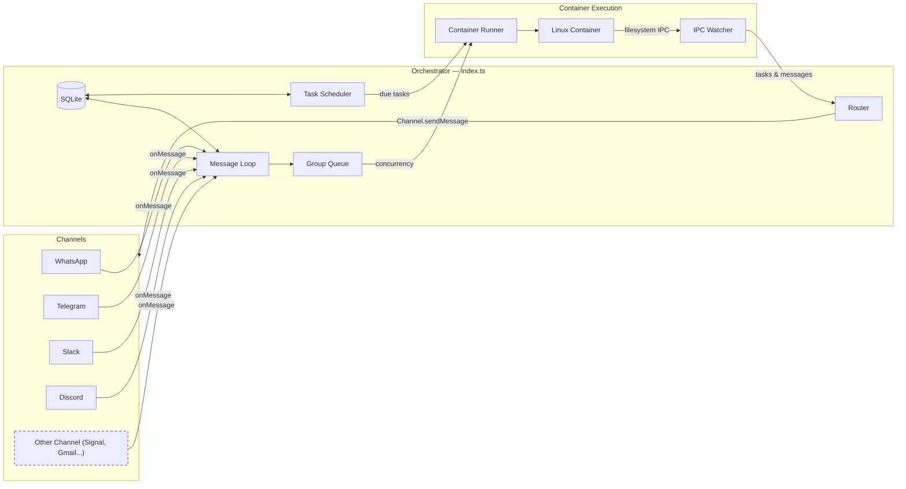

# EvoClaw 規格文件

一個個人 Claude 助理，具備多頻道支援、每次對話的持久記憶、排程任務，以及容器隔離的代理程序執行環境。

---

## 目錄

1. [架構](#architecture)
2. [架構：頻道系統](#architecture-channel-system)
3. [資料夾結構](#folder-structure)
4. [設定](#configuration)
5. [記憶系統](#memory-system)
6. [會話管理](#session-management)
7. [訊息流程](#message-flow)
8. [指令](#commands)
9. [排程任務](#scheduled-tasks)
10. [MCP 伺服器](#mcp-servers)
11. [部署](#deployment)
12. [安全考量](#security-considerations)

---

## 架構

```
┌──────────────────────────────────────────────────────────────────────┐
│                        HOST (macOS / Linux)                           │
│                     (Main Node.js Process)                            │
├──────────────────────────────────────────────────────────────────────┤
│                                                                       │
│  ┌──────────────────┐                  ┌────────────────────┐        │
│  │ Channels         │─────────────────▶│   SQLite Database  │        │
│  │ (self-register   │◀────────────────│   (messages.db)    │        │
│  │  at startup)     │  store/send      └─────────┬──────────┘        │
│  └──────────────────┘                            │                   │
│                                                   │                   │
│         ┌─────────────────────────────────────────┘                   │
│         │                                                             │
│         ▼                                                             │
│  ┌──────────────────┐    ┌──────────────────┐    ┌───────────────┐   │
│  │  Message Loop    │    │  Scheduler Loop  │    │  IPC Watcher  │   │
│  │  (polls SQLite)  │    │  (checks tasks)  │    │  (file-based) │   │
│  └────────┬─────────┘    └────────┬─────────┘    └───────────────┘   │
│           │                       │                                   │
│           └───────────┬───────────┘                                   │
│                       │ spawns container                              │
│                       ▼                                               │
├──────────────────────────────────────────────────────────────────────┤
│                     CONTAINER (Linux VM)                               │
├──────────────────────────────────────────────────────────────────────┤
│  ┌──────────────────────────────────────────────────────────────┐    │
│  │                    AGENT RUNNER                               │    │
│  │                                                                │    │
│  │  Working directory: /workspace/group (mounted from host)       │    │
│  │  Volume mounts:                                                │    │
│  │    • groups/{name}/ → /workspace/group                         │    │
│  │    • groups/global/ → /workspace/global/ (non-main only)       │    │
│  │    • data/sessions/{group}/.claude/ → /home/node/.claude/      │    │
│  │    • Additional dirs → /workspace/extra/*                      │    │
│  │                                                                │    │
│  │  Tools (all groups):                                           │    │
│  │    • Bash (safe - sandboxed in container!)                     │    │
│  │    • Read, Write, Edit, Glob, Grep (file operations)           │    │
│  │    • WebSearch, WebFetch (internet access)                     │    │
│  │    • agent-browser (browser automation)                        │    │
│  │    • mcp__evoclaw__* (scheduler tools via IPC)                │    │
│  │                                                                │    │
│  └──────────────────────────────────────────────────────────────┘    │
│                                                                       │
└───────────────────────────────────────────────────────────────────────┘
```

### 技術堆疊

| 元件 | 技術 | 用途 |
|------|------|------|
| 頻道系統 | 頻道登錄表（`src/channels/registry.ts`） | 頻道在啟動時自我註冊 |
| 訊息儲存 | SQLite (better-sqlite3) | 儲存訊息以供輪詢 |
| 容器執行環境 | 容器（Linux VMs） | 代理程序執行的隔離環境 |
| 代理程序 | @google/genai (0.2.29) | 帶工具和 MCP 伺服器執行 Claude |
| 瀏覽器自動化 | agent-browser + Chromium | 網頁互動與截圖 |
| 執行環境 | Node.js 20+ | 用於路由和排程的主機程序 |
| 網頁儀表板 | `host/dashboard.py`（Python 標準函式庫） | 深色主題監控儀表板，連接埠 8765 |
| 網頁入口 | `host/webportal.py`（Python 標準函式庫） | 瀏覽器聊天介面，連接埠 8766 |
| 演化記錄器 | `host/evolution/` + `evolution_log` 資料表 | 記錄每個演化事件及基因組快照 |

---

## 架構：頻道系統

核心不內建任何頻道——每個頻道（WhatsApp、Telegram、Slack、Discord、Gmail）都作為 [Claude Code skill](https://code.claude.com/docs/en/skills) 安裝，將頻道程式碼添加到你的 fork 中。頻道在啟動時自我註冊；已安裝但缺少憑證的頻道會輸出 WARN 日誌並被跳過。

### 系統圖



### 頻道登錄表

頻道系統建立在 `src/channels/registry.ts` 中的工廠登錄表上：

```typescript
export type ChannelFactory = (opts: ChannelOpts) => Channel | null;

const registry = new Map<string, ChannelFactory>();

export function registerChannel(name: string, factory: ChannelFactory): void {
  registry.set(name, factory);
}

export function getChannelFactory(name: string): ChannelFactory | undefined {
  return registry.get(name);
}

export function getRegisteredChannelNames(): string[] {
  return [...registry.keys()];
}
```

每個工廠接收 `ChannelOpts`（包含 `onMessage`、`onChatMetadata` 和 `registeredGroups` 的回呼函式），並傳回 `Channel` 實例，若該頻道的憑證未設定則傳回 `null`。

### 頻道介面

每個頻道都實作此介面（定義於 `src/types.ts`）：

```typescript
interface Channel {
  name: string;
  connect(): Promise<void>;
  sendMessage(jid: string, text: string): Promise<void>;
  isConnected(): boolean;
  ownsJid(jid: string): boolean;
  disconnect(): Promise<void>;
  setTyping?(jid: string, isTyping: boolean): Promise<void>;
  syncGroups?(force: boolean): Promise<void>;
}
```

### 自我註冊模式

頻道使用桶狀匯入模式進行自我註冊：

1. 每個頻道技能在 `src/channels/` 中添加一個檔案（例如 `whatsapp.ts`、`telegram.ts`），在模組載入時呼叫 `registerChannel()`：

   ```typescript
   // src/channels/whatsapp.ts
   import { registerChannel, ChannelOpts } from './registry.js';

   export class WhatsAppChannel implements Channel { /* ... */ }

   registerChannel('whatsapp', (opts: ChannelOpts) => {
     // Return null if credentials are missing
     if (!existsSync(authPath)) return null;
     return new WhatsAppChannel(opts);
   });
   ```

2. 桶狀檔案 `src/channels/index.ts` 匯入所有頻道模組，觸發註冊：

   ```typescript
   import './whatsapp.js';
   import './telegram.js';
   // ... each skill adds its import here
   ```

3. 啟動時，協調器（`src/index.ts`）遍歷已註冊的頻道，連接那些傳回有效實例的頻道：

   ```typescript
   for (const name of getRegisteredChannelNames()) {
     const factory = getChannelFactory(name);
     const channel = factory?.(channelOpts);
     if (channel) {
       await channel.connect();
       channels.push(channel);
     }
   }
   ```

### 關鍵檔案

| 檔案 | 用途 |
|------|------|
| `src/channels/registry.ts` | 頻道工廠登錄表 |
| `src/channels/index.ts` | 觸發頻道自我註冊的桶狀匯入 |
| `src/types.ts` | `Channel` 介面、`ChannelOpts`、訊息類型 |
| `src/index.ts` | 協調器——實例化頻道、執行訊息迴圈 |
| `src/router.ts` | 尋找 JID 的所屬頻道，格式化訊息 |

### 添加新頻道

要添加新頻道，請在 `.claude/skills/add-<name>/` 中貢獻一個技能，內容包括：

1. 添加實作 `Channel` 介面的 `src/channels/<name>.ts` 檔案
2. 在模組載入時呼叫 `registerChannel(name, factory)`
3. 若憑證缺失，從工廠傳回 `null`
4. 在 `src/channels/index.ts` 中添加匯入行

請參考現有技能（`/add-whatsapp`、`/add-telegram`、`/add-slack`、`/add-discord`、`/add-gmail`）了解模式。

---

## 資料夾結構

```
evoclaw/
├── CLAUDE.md                      # Claude Code 的專案上下文
├── docs/
│   ├── SPEC.md                    # 本規格文件
│   ├── REQUIREMENTS.md            # 架構決策
│   └── SECURITY.md                # 安全模型
├── README.md                      # 使用者文件
├── package.json                   # Node.js 相依套件
├── tsconfig.json                  # TypeScript 設定
├── .mcp.json                      # MCP 伺服器設定（參考）
├── .gitignore
│
├── src/
│   ├── index.ts                   # 協調器：狀態、訊息迴圈、代理程序調用
│   ├── channels/
│   │   ├── registry.ts            # 頻道工廠登錄表
│   │   └── index.ts               # 頻道自我註冊的桶狀匯入
│   ├── ipc.ts                     # IPC 監看器與任務處理
│   ├── router.ts                  # 訊息格式化與對外路由
│   ├── config.ts                  # 設定常數
│   ├── types.ts                   # TypeScript 介面（包含 Channel）
│   ├── logger.ts                  # Pino 記錄器設定
│   ├── db.ts                      # SQLite 資料庫初始化與查詢
│   ├── group-queue.ts             # 具全域並發限制的每群組佇列
│   ├── mount-security.ts          # 容器掛載允許清單驗證
│   ├── whatsapp-auth.ts           # 獨立 WhatsApp 驗證
│   ├── task-scheduler.ts          # 到期時執行排程任務
│   └── container-runner.ts        # 在容器中產生代理程序
│
├── container/
│   ├── Dockerfile                 # 容器映像（以 'node' 使用者執行，包含 Claude Code CLI）
│   ├── build.sh                   # 容器映像建置腳本
│   ├── agent-runner/              # 在容器內部執行的程式碼
│   │   ├── package.json
│   │   ├── tsconfig.json
│   │   └── src/
│   │       ├── index.ts           # 入口點（查詢迴圈、IPC 輪詢、會話恢復）
│   │       └── ipc-mcp-stdio.ts   # 用於主機通訊的 Stdio 型 MCP 伺服器
│   └── skills/
│       └── agent-browser.md       # 瀏覽器自動化技能
│
├── dist/                          # 編譯後的 JavaScript（已加入 gitignore）
│
├── .claude/
│   └── skills/
│       ├── setup/SKILL.md              # /setup - 首次安裝
│       ├── customize/SKILL.md          # /customize - 添加功能
│       ├── debug/SKILL.md              # /debug - 容器除錯
│       ├── add-telegram/SKILL.md       # /add-telegram - Telegram 頻道
│       ├── add-gmail/SKILL.md          # /add-gmail - Gmail 整合
│       ├── add-voice-transcription/    # /add-voice-transcription - Whisper
│       ├── x-integration/SKILL.md      # /x-integration - X/Twitter
│       ├── convert-to-apple-container/  # /convert-to-apple-container - Apple Container 執行環境
│       └── add-parallel/SKILL.md       # /add-parallel - 並行代理程序
│
├── groups/
│   ├── CLAUDE.md                  # 全域記憶（所有群組讀取此檔）
│   ├── {channel}_main/             # 主控制頻道（例如 whatsapp_main/）
│   │   ├── CLAUDE.md              # 主頻道記憶
│   │   └── logs/                  # 任務執行日誌
│   └── {channel}_{group-name}/    # 每群組資料夾（在註冊時建立）
│       ├── CLAUDE.md              # 群組特定記憶
│       ├── logs/                  # 此群組的任務日誌
│       └── *.md                   # 代理程序建立的檔案
│
├── store/                         # 本地資料（已加入 gitignore）
│   ├── auth/                      # WhatsApp 驗證狀態
│   └── messages.db                # SQLite 資料庫（messages、chats、scheduled_tasks、task_run_logs、registered_groups、sessions、router_state、evolution_log）
│
├── data/                          # 應用程式狀態（已加入 gitignore）
│   ├── sessions/                  # 每群組會話資料（帶 JSONL 轉錄的 .claude/ 目錄）
│   ├── env/env                    # 用於容器掛載的 .env 副本
│   └── ipc/                       # 容器 IPC（messages/、tasks/）
│
├── logs/                          # 執行期日誌（已加入 gitignore）
│   ├── evoclaw.log               # 主機 stdout
│   └── evoclaw.error.log         # 主機 stderr
│   # 注意：每個容器的日誌位於 groups/{folder}/logs/container-*.log
│
└── launchd/
    └── com.evoclaw.plist         # macOS 服務設定
```

---

## 設定

設定常數位於 `src/config.ts`：

```typescript
import path from 'path';

export const ASSISTANT_NAME = process.env.ASSISTANT_NAME || 'Eve';
export const POLL_INTERVAL = 2000;
export const SCHEDULER_POLL_INTERVAL = 60000;

// Paths are absolute (required for container mounts)
const PROJECT_ROOT = process.cwd();
export const STORE_DIR = path.resolve(PROJECT_ROOT, 'store');
export const GROUPS_DIR = path.resolve(PROJECT_ROOT, 'groups');
export const DATA_DIR = path.resolve(PROJECT_ROOT, 'data');

// Container configuration
export const CONTAINER_IMAGE = process.env.CONTAINER_IMAGE || 'evoclaw-agent:latest';
export const CONTAINER_TIMEOUT = parseInt(process.env.CONTAINER_TIMEOUT || '1800000', 10); // 30min default
export const IPC_POLL_INTERVAL = 1000;
export const IDLE_TIMEOUT = parseInt(process.env.IDLE_TIMEOUT || '1800000', 10); // 30min — keep container alive after last result
export const MAX_CONCURRENT_CONTAINERS = Math.max(1, parseInt(process.env.MAX_CONCURRENT_CONTAINERS || '5', 10) || 5);

export const TRIGGER_PATTERN = new RegExp(`^@${ASSISTANT_NAME}\\b`, 'i');
```

**注意：** 路徑必須為絕對路徑，容器磁碟區掛載才能正常運作。

### 容器設定

群組可以透過 SQLite `registered_groups` 資料表中的 `containerConfig`（以 JSON 形式儲存於 `container_config` 欄位）掛載額外的目錄。範例註冊：

```typescript
registerGroup("1234567890@g.us", {
  name: "Dev Team",
  folder: "whatsapp_dev-team",
  trigger: "@Eve",
  added_at: new Date().toISOString(),
  containerConfig: {
    additionalMounts: [
      {
        hostPath: "~/projects/webapp",
        containerPath: "webapp",
        readonly: false,
      },
    ],
    timeout: 600000,
  },
});
```

資料夾名稱遵循 `{channel}_{group-name}` 的命名慣例（例如 `whatsapp_family-chat`、`telegram_dev-team`）。主群組在註冊時設定 `isMain: true`。

額外掛載出現在容器內的 `/workspace/extra/{containerPath}`。

**掛載語法注意事項：** 讀寫掛載使用 `-v host:container`，但唯讀掛載需要 `--mount "type=bind,source=...,target=...,readonly"`（`:ro` 後綴在所有執行環境上可能無法正常運作）。

### Claude 驗證

在專案根目錄的 `.env` 檔案中設定驗證。有兩個選項：

**選項 1：Claude 訂閱（OAuth 令牌）**
```bash
GOOGLE_API_KEY=sk-ant-oat01-...
```
如果你已登入 Claude Code，可以從 `~/.claude/.credentials.json` 中提取令牌。

**選項 2：按用量計費的 API Key**
```bash
GOOGLE_API_KEY=sk-ant-api03-...
```

只有驗證變數（`GOOGLE_API_KEY` 和 `GOOGLE_API_KEY`）從 `.env` 中提取並寫入 `data/env/env`，然後掛載至容器的 `/workspace/env-dir/env` 並由入口點腳本載入。這確保 `.env` 中的其他環境變數不會暴露給代理程序。這個變通方案是必要的，因為某些容器執行環境在使用帶有管道 stdin 的 `-i`（互動模式）時會遺失 `-e` 環境變數。

### 變更助理名稱

設定 `ASSISTANT_NAME` 環境變數：

```bash
ASSISTANT_NAME=Bot npm start
```

或在 `src/config.ts` 中編輯預設值。這將變更：
- 觸發模式（訊息必須以 `@YourName` 開頭）
- 回應前綴（自動添加 `YourName:`）

### launchd 中的佔位符值

含有 `{{PLACEHOLDER}}` 值的檔案需要設定：
- `{{PROJECT_ROOT}}` - 你的 evoclaw 安裝的絕對路徑
- `{{NODE_PATH}}` - node 執行檔的路徑（透過 `which node` 偵測）
- `{{HOME}}` - 使用者的家目錄

---

## 記憶系統

EvoClaw 使用基於 CLAUDE.md 檔案的層級記憶系統。

### 記憶層級

| 層級 | 位置 | 讀取者 | 寫入者 | 用途 |
|------|------|--------|--------|------|
| **全域** | `groups/CLAUDE.md` | 所有群組 | 僅 Main | 跨所有對話共享的偏好設定、事實、上下文 |
| **群組** | `groups/{name}/CLAUDE.md` | 該群組 | 該群組 | 群組特定上下文、對話記憶 |
| **檔案** | `groups/{name}/*.md` | 該群組 | 該群組 | 對話期間建立的筆記、研究、文件 |

### 記憶的運作方式

1. **代理程序上下文載入**
   - 代理程序以 `cwd` 設定為 `groups/{group-name}/` 執行
   - 帶有 `settingSources: ['project']` 的 Claude Agent SDK 自動載入：
     - `../CLAUDE.md`（父目錄 = 全域記憶）
     - `./CLAUDE.md`（當前目錄 = 群組記憶）

2. **寫入記憶**
   - 當使用者說「記住這個」時，代理程序寫入 `./CLAUDE.md`
   - 當使用者說「全域記住這個」（僅限主頻道），代理程序寫入 `../CLAUDE.md`
   - 代理程序可以在群組資料夾中建立如 `notes.md`、`research.md` 之類的檔案

3. **主頻道特權**
   - 只有「main」群組（自我對話）可以寫入全域記憶
   - Main 可以管理已註冊的群組並為任何群組安排任務
   - Main 可以為任何群組設定額外的目錄掛載
   - 所有群組都有 Bash 存取權（安全，因為在容器內執行）

---

## 會話管理

會話讓對話具有連續性——Claude 記得你們談過的內容。

### 會話的運作方式

1. 每個群組都有一個儲存在 SQLite 中的會話 ID（`sessions` 資料表，以 `group_folder` 為索引鍵）
2. 會話 ID 傳遞給 Claude Agent SDK 的 `resume` 選項
3. Claude 繼續具有完整上下文的對話
4. 會話轉錄以 JSONL 檔案形式儲存於 `data/sessions/{group}/.claude/`

---

## 訊息流程

### 傳入訊息流程

```
1. 使用者透過任何已連接的頻道傳送訊息
   │
   ▼
2. 頻道接收訊息（例如 WhatsApp 使用 Baileys，Telegram 使用 Bot API）
   │
   ▼
3. 訊息儲存於 SQLite（store/messages.db）
   │
   ▼
4. 訊息迴圈輪詢 SQLite（每 2 秒）
   │
   ▼
5. 路由器檢查：
   ├── chat_jid 是否在已註冊群組中（SQLite）？→ 否：忽略
   └── 訊息是否符合觸發模式？→ 否：儲存但不處理
   │
   ▼
6. 路由器補上對話：
   ├── 提取自上次代理程序互動以來的所有訊息
   ├── 以時間戳記和傳送者名稱格式化
   └── 建立包含完整對話上下文的提示
   │
   ▼
7. 路由器調用 Claude Agent SDK：
   ├── cwd: groups/{group-name}/
   ├── prompt: 對話歷史 + 當前訊息
   ├── resume: session_id（用於連續性）
   └── mcpServers: evoclaw（排程器）
   │
   ▼
8. Claude 處理訊息：
   ├── 讀取 CLAUDE.md 檔案以獲取上下文
   └── 視需要使用工具（搜尋、電子郵件等）
   │
   ▼
9. 路由器以助理名稱作為回應前綴，並透過所屬頻道傳送
   │
   ▼
10. 路由器更新最後代理程序時間戳記並儲存會話 ID
```

### 觸發詞比對

訊息必須以觸發模式開頭（預設：`@Eve`）：
- `@Eve what's the weather?` → ✅ 觸發 Claude
- `@andy help me` → ✅ 觸發（不區分大小寫）
- `Hey @Eve` → ❌ 忽略（觸發詞不在開頭）
- `What's up?` → ❌ 忽略（無觸發詞）

### 對話補充

當觸發訊息到達時，代理程序會收到自其上次在該聊天中互動以來的所有訊息。每則訊息以時間戳記和傳送者名稱格式化：

```
[Jan 31 2:32 PM] John: hey everyone, should we do pizza tonight?
[Jan 31 2:33 PM] Sarah: sounds good to me
[Jan 31 2:35 PM] John: @Eve what toppings do you recommend?
```

這讓代理程序能夠理解對話上下文，即使它並未在每條訊息中被提及。

---

## 指令

### 任何群組中可用的指令

| 指令 | 範例 | 效果 |
|------|------|------|
| `@Assistant [message]` | `@Eve what's the weather?` | 與 Claude 對話 |

### 僅主頻道可用的指令

| 指令 | 範例 | 效果 |
|------|------|------|
| `@Assistant add group "Name"` | `@Eve add group "Family Chat"` | 註冊新群組 |
| `@Assistant remove group "Name"` | `@Eve remove group "Work Team"` | 取消註冊群組 |
| `@Assistant list groups` | `@Eve list groups` | 顯示已註冊群組 |
| `@Assistant remember [fact]` | `@Eve remember I prefer dark mode` | 添加至全域記憶 |

---

## 排程任務

EvoClaw 內建一個排程器，以完整代理程序的身份在群組上下文中執行任務。

### 排程的運作方式

1. **群組上下文**：在群組中建立的任務以該群組的工作目錄和記憶執行
2. **完整代理程序功能**：排程任務可以存取所有工具（WebSearch、檔案操作等）
3. **可選的訊息傳送**：任務可以使用 `send_message` 工具傳送訊息給群組，或靜默完成
4. **主頻道特權**：主頻道可以為任何群組安排任務並查看所有任務

### 排程類型

| 類型 | 值格式 | 範例 |
|------|--------|------|
| `cron` | Cron 表達式 | `0 9 * * 1`（每週一上午 9 點） |
| `interval` | 毫秒 | `3600000`（每小時） |
| `once` | ISO 時間戳記 | `2024-12-25T09:00:00Z` |

### 建立任務

```
User: @Eve remind me every Monday at 9am to review the weekly metrics

Claude: [calls mcp__evoclaw__schedule_task]
        {
          "prompt": "Send a reminder to review weekly metrics. Be encouraging!",
          "schedule_type": "cron",
          "schedule_value": "0 9 * * 1"
        }

Claude: Done! I'll remind you every Monday at 9am.
```

### 一次性任務

```
User: @Eve at 5pm today, send me a summary of today's emails

Claude: [calls mcp__evoclaw__schedule_task]
        {
          "prompt": "Search for today's emails, summarize the important ones, and send the summary to the group.",
          "schedule_type": "once",
          "schedule_value": "2024-01-31T17:00:00Z"
        }
```

### 管理任務

從任何群組：
- `@Eve list my scheduled tasks` - 查看此群組的任務
- `@Eve pause task [id]` - 暫停任務
- `@Eve resume task [id]` - 恢復暫停的任務
- `@Eve cancel task [id]` - 刪除任務

從主頻道：
- `@Eve list all tasks` - 查看所有群組的任務
- `@Eve schedule task for "Family Chat": [prompt]` - 為其他群組安排任務

---

## 演化引擎

EvoClaw 內建一個仿生物啟發的自適應系統，位於 `host/evolution/`。

### 檔案

| 檔案 | 用途 |
|------|------|
| `host/evolution/fitness.py` | 適應度追蹤——記錄每次回應的回應時間、成功率、重試次數 |
| `host/evolution/adaptive.py` | 表觀遺傳提示——計算環境驅動的行為修飾符（負載、一天中的時間、星期幾） |
| `host/evolution/genome.py` | 群組基因組——每群組的行為參數（回應風格、正式程度、技術深度） |
| `host/evolution/immune.py` | 免疫系統——偵測提示注入和垃圾訊息，建立持久威脅記憶 |
| `host/evolution/daemon.py` | 演化守護程序——24 小時週期，分析適應度資料並調整群組基因組 |

### 資料庫：evolution_log 資料表

每個演化事件都記錄在 `evolution_log` 資料表中：

| 欄位 | 類型 | 說明 |
|------|------|------|
| `id` | INTEGER | 主鍵 |
| `event_type` | TEXT | 其中之一：`genome_evolved`、`genome_unchanged`、`cycle_start`、`cycle_end`、`skipped_low_samples` |
| `group_folder` | TEXT | 此事件適用的群組 |
| `timestamp` | TEXT | ISO 時間戳記 |
| `genome_before` | TEXT (JSON) | 演化步驟前的基因組快照 |
| `genome_after` | TEXT (JSON) | 演化步驟後的基因組快照 |
| `details` | TEXT (JSON) | 額外的事件元資料 |

儀表板顯示最近 30 個事件，以顏色區分事件類型。

### 排程任務狀態

排程任務現在有一個 `status` 欄位：

| 值 | 含義 |
|----|------|
| `active` | 任務正常執行中 |
| `error` | 找不到群組——任務在修復前不會重試 |
| `cancelled` | 任務已被代理程序或使用者取消 |

孤立任務（`chat_jid` 為空的任務）在啟動時自動刪除。

---

## 網頁介面

### 網頁儀表板

**檔案：** `host/dashboard.py`
**預設連接埠：** 8765（環境變數：`DASHBOARD_PORT`）

使用 Python 標準函式庫建置的深色主題監控儀表板——無外部相依套件。

區段：
- 群組、排程任務、任務執行日誌、會話、訊息、演化統計、演化日誌、免疫威脅

端點：
- `/` — 主儀表板（每 10 秒自動刷新）
- `/health` — JSON 健康檢查（DB + Docker）。傳回 200 OK 或 503 Service Unavailable
- `/metrics` — Prometheus 格式的所有資料表列數

驗證：透過 `DASHBOARD_USER` / `DASHBOARD_PASSWORD` 環境變數進行 HTTP Basic Auth。若 `DASHBOARD_PASSWORD` 為空，則停用驗證。

### 網頁入口

**檔案：** `host/webportal.py`
**預設連接埠：** 8766（環境變數：`WEBPORTAL_PORT`）

使用長輪詢的瀏覽器聊天介面（無 WebSocket 相依）。預設停用。

功能：
- 群組選擇器下拉選單
- 可捲動的聊天視圖，1 秒輪詢
- `deliver_reply(group_folder, text)` 函式——由主機呼叫以將機器人回應推送到瀏覽器

透過 `WEBPORTAL_ENABLED=true` 啟用。

### 環境變數（網頁介面）

| 變數 | 預設值 | 說明 |
|------|--------|------|
| `DASHBOARD_PORT` | `8765` | 網頁儀表板連接埠 |
| `DASHBOARD_USER` | `admin` | Basic Auth 使用者名稱 |
| `DASHBOARD_PASSWORD` | _（空）_ | Basic Auth 密碼。空值 = 無驗證 |
| `WEBPORTAL_ENABLED` | `false` | 啟用瀏覽器聊天介面 |
| `WEBPORTAL_PORT` | `8766` | 網頁入口連接埠 |
| `WEBPORTAL_HOST` | `127.0.0.1` | 網頁入口繫結位址 |

---

## MCP 伺服器

### EvoClaw MCP（內建）

`evoclaw` MCP 伺服器依據當前群組的上下文，在每次代理程序呼叫時動態建立。

**可用工具：**
| 工具 | 用途 |
|------|------|
| `schedule_task` | 安排週期性或一次性任務 |
| `list_tasks` | 顯示任務（群組的任務，若為 main 則顯示全部）。也透過輸入酬載中的 `scheduledTasks` 暴露給容器代理程序 |
| `get_task` | 取得任務詳細資訊和執行歷史記錄 |
| `update_task` | 修改任務提示或排程 |
| `pause_task` | 暫停任務 |
| `resume_task` | 恢復暫停的任務 |
| `cancel_task` | 刪除/取消任務。容器代理程序可直接透過 `cancel_task(task_id)` 工具呼叫此功能 |
| `send_message` | 透過頻道傳送訊息給群組 |

---

## 部署

EvoClaw 以單一 macOS launchd 服務執行。

### 啟動順序

EvoClaw 啟動時：
1. **確保容器執行環境正在執行** - 若需要則自動啟動；終止前次執行遺留的孤立 EvoClaw 容器
2. 初始化 SQLite 資料庫（若 JSON 檔案存在則從中遷移）
3. 從 SQLite 載入狀態（已註冊群組、會話、路由器狀態）
4. **連接頻道** — 遍歷已註冊的頻道，實例化有憑證的頻道，在每個頻道上呼叫 `connect()`
5. 一旦至少有一個頻道連接：
   - 啟動排程器迴圈
   - 啟動用於容器訊息的 IPC 監看器
   - 以 `processGroupMessages` 設定每群組佇列
   - 恢復關閉前未處理的訊息
   - 啟動訊息輪詢迴圈

### 服務：com.evoclaw

**launchd/com.evoclaw.plist：**
```xml
<?xml version="1.0" encoding="UTF-8"?>
<!DOCTYPE plist PUBLIC "-//Apple//DTD PLIST 1.0//EN" "...">
<plist version="1.0">
<dict>
    <key>Label</key>
    <string>com.evoclaw</string>
    <key>ProgramArguments</key>
    <array>
        <string>{{NODE_PATH}}</string>
        <string>{{PROJECT_ROOT}}/dist/index.js</string>
    </array>
    <key>WorkingDirectory</key>
    <string>{{PROJECT_ROOT}}</string>
    <key>RunAtLoad</key>
    <true/>
    <key>KeepAlive</key>
    <true/>
    <key>EnvironmentVariables</key>
    <dict>
        <key>PATH</key>
        <string>{{HOME}}/.local/bin:/usr/local/bin:/usr/bin:/bin</string>
        <key>HOME</key>
        <string>{{HOME}}</string>
        <key>ASSISTANT_NAME</key>
        <string>Eve</string>
    </dict>
    <key>StandardOutPath</key>
    <string>{{PROJECT_ROOT}}/logs/evoclaw.log</string>
    <key>StandardErrorPath</key>
    <string>{{PROJECT_ROOT}}/logs/evoclaw.error.log</string>
</dict>
</plist>
```

### 管理服務

```bash
# 安裝服務
cp launchd/com.evoclaw.plist ~/Library/LaunchAgents/

# 啟動服務
launchctl load ~/Library/LaunchAgents/com.evoclaw.plist

# 停止服務
launchctl unload ~/Library/LaunchAgents/com.evoclaw.plist

# 檢查狀態
launchctl list | grep evoclaw

# 查看日誌
tail -f logs/evoclaw.log
```

---

## 安全考量

### 容器隔離

所有代理程序在容器（輕量 Linux VMs）內執行，提供：
- **檔案系統隔離**：代理程序只能存取已掛載的目錄
- **安全的 Bash 存取**：指令在容器內執行，而非在你的 Mac 上
- **網路隔離**：可按需為每個容器設定
- **程序隔離**：容器程序不會影響主機
- **非 root 使用者**：容器以無特權的 `node` 使用者（uid 1000）執行

### 提示注入風險

WhatsApp 訊息可能包含惡意指令，試圖操縱 Claude 的行為。

**緩解措施：**
- 容器隔離限制了影響範圍
- 只有已註冊的群組才會被處理
- 需要觸發詞（減少意外處理）
- 代理程序只能存取其群組的已掛載目錄
- Main 可以為每個群組設定額外的目錄
- Claude 內建的安全訓練

**建議：**
- 只註冊受信任的群組
- 仔細審查額外的目錄掛載
- 定期審查排程任務
- 監控日誌以發現異常活動

### 憑證儲存

| 憑證 | 儲存位置 | 注意事項 |
|------|----------|----------|
| Claude CLI Auth | data/sessions/{group}/.claude/ | 每群組隔離，掛載至 /home/node/.claude/ |
| WhatsApp Session | store/auth/ | 自動建立，持續約 20 天 |

### 檔案權限

groups/ 資料夾包含個人記憶，應受到保護：
```bash
chmod 700 groups/
```

---

## 疑難排解

### 常見問題

| 問題 | 原因 | 解決方案 |
|------|------|----------|
| 訊息無回應 | 服務未執行 | 檢查 `launchctl list | grep evoclaw` |
| "Claude Code process exited with code 1" | 容器執行環境啟動失敗 | 檢查日誌；EvoClaw 會自動啟動容器執行環境，但可能失敗 |
| "Claude Code process exited with code 1" | 會話掛載路徑錯誤 | 確保掛載到 `/home/node/.claude/` 而非 `/root/.claude/` |
| 會話未繼續 | 會話 ID 未儲存 | 檢查 SQLite：`sqlite3 store/messages.db "SELECT * FROM sessions"` |
| 會話未繼續 | 掛載路徑不符 | 容器使用者為 `node`，HOME=/home/node；會話必須在 `/home/node/.claude/` |
| "QR code expired" | WhatsApp 會話已過期 | 刪除 store/auth/ 並重新啟動 |
| "No groups registered" | 尚未添加群組 | 在 main 中使用 `@Eve add group "Name"` |

### 日誌位置

- `logs/evoclaw.log` - stdout
- `logs/evoclaw.error.log` - stderr

### 除錯模式

手動執行以獲取詳細輸出：
```bash
npm run dev
# or
node dist/index.js
```
